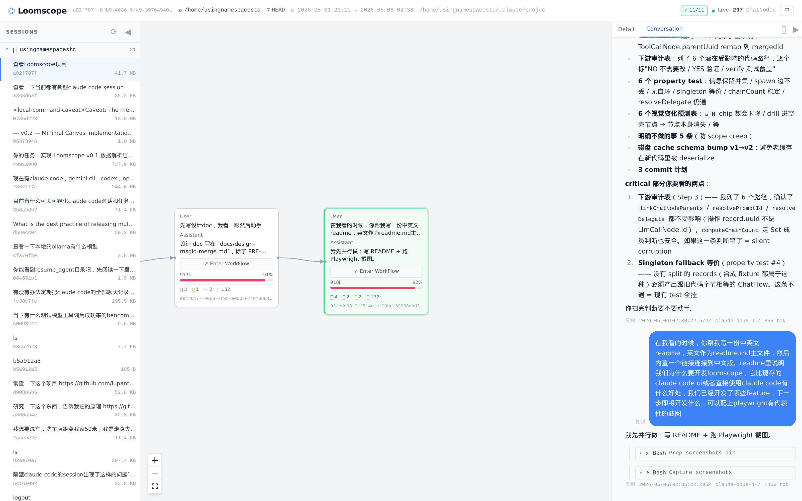
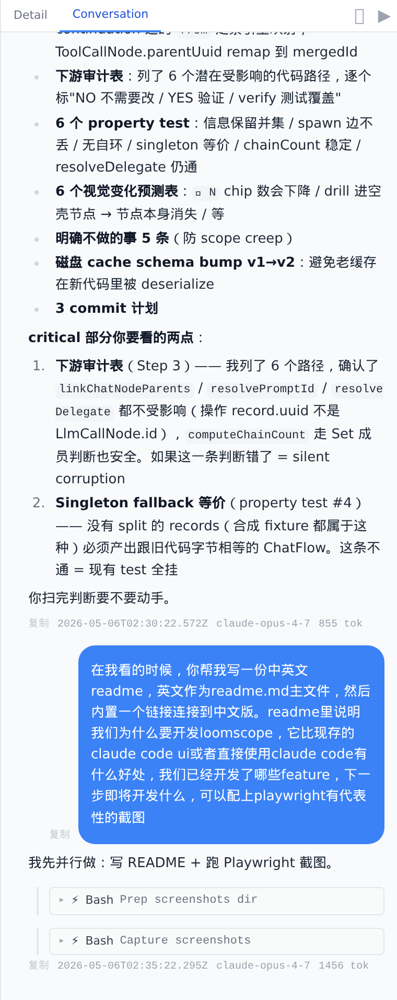
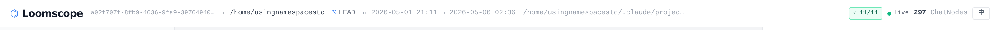
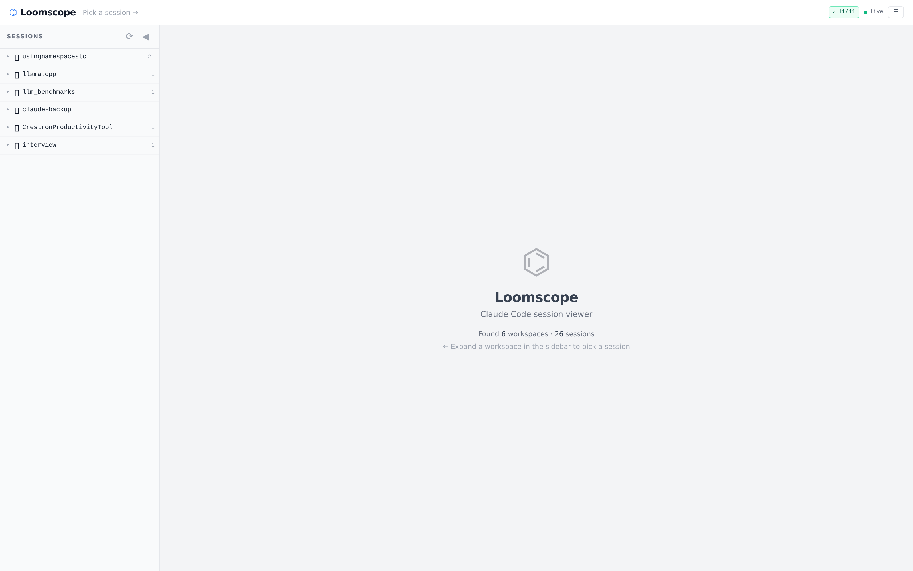

# Loomscope

**Claude Code 会话记录的可视化阅读器。** 把线性的 `~/.claude/projects/<...>/<sid>.jsonl` 文件渲染成一个 DAG 画布，呈现每一轮对话、工具调用、子代理（sub-agent）、分叉（fork）、压缩（compact）。read-only 设计，跟终端 CC 并存，不抢占文件锁。

[English README](./README.md) · [Changelog](./CHANGELOG.md)



> **状态（2026-05-07）**：**v1.0.0-rc.1** 内部试用版本。read-only viewer + 实时 SSE 观察 + 11 个 CC hook 事件 + 4-tab DrillPanel（对话 / 详情 / 变更 / 实际上下文）已全部 ship。下一站 v∞.1（Loomscope 用 Agent SDK 起新 session + 浏览器响应权限）。

## 快速开始

```sh
git clone https://github.com/usingnamespacestc/Loomscope.git
cd Loomscope
npm install
npm run build       # vite build → dist/
npm run start       # tsx src/server/cli.ts（自动检测 dist/，单端口）
```

打开 <http://localhost:5174>。Loomscope 会自动扫 `~/.claude/projects/`，从左侧 sidebar 选个 session 就能进。

要让 SSE 实时更新（CC 跑的时候 canvas 跟着变），按下面 **配 CC hooks** 一节走 —— 应用内 onboarding 弹窗会一步步带你做。

## 为什么要 Loomscope

Claude Code 是个强大的 agent CLI，但它的会话阅读体验**只有终端滚动条**。一旦会话超过几轮 —— 更别说 256 MB session 经过十几次 compact、派出过 sub-agent、被 `/branch` 分叉过 —— 想回答下面这些简单问题就很痛：

- *这一轮 agent 调了哪些工具？* → 在终端往上滚找
- *第 3 个 sub-agent 实际做了啥？* → 找 sidecar `.jsonl` 文件读原文
- *这个分支跟原 session 在哪儿分的家？* → 拿两个文件互对
- *CC 现在到底在等啥？* → 切回终端
- *上周问 Claude 那个 X 问题在哪个 session？* → 没法答

Loomscope 把这些问题改用**结构化视图**回答，而不是文本搜索。

### 跟其它选择对比

| | 终端 CC（`claude`）| claude.ai/code | IDE 插件 | **Loomscope** |
|---|---|---|---|---|
| 线性滚动浏览 | ✓ | ✓ | ✓ | ✓（Conversation panel） |
| **工具调用 DAG 视图** | ✗ | ✗ | ✗ | ✓ |
| **子代理内部 trace 可展开嵌套 ChatFlow** | ✗ | ✗ | ✗ | ✓ |
| **分叉树**（`/branch` + restore）| ✗ | ✗ | ✗ | ✓ |
| 跨 session sidebar | ✗ | 部分 | 部分 | ✓ |
| 实时 tail（jsonl 追加）| n/a | ✓ | ✓ | ✓ |
| **浏览器看 CC 在等权限** | 终端 y/n | 终端 y/n | 终端 y/n | ✓ banner |
| **Compact 范围折叠 + drill** | ✗ | ✗ | ✗ | ✓ |
| 摆脱终端的工作流 | ✗ | 部分 | 部分 | v∞.1（开发中）|

CC CLI 是 agent 的运行时，Loomscope 是配套的**只读图形化阅读器**。两者不冲突 —— 都看同一份 jsonl 文件。终端正常 `claude`，浏览器开 Loomscope 看结构 / 实时观察。

## 核心展示

> **术语说明 —— `ChatFlow` / `WorkFlow` 是 Loomscope 的解读层，不是 Claude Code 的原生数据模型。** CC 在 session 里写的就是一条线性 `parentUuid` 链（`user` / `assistant` / `system` / `attachment` 全都串在这一条链上），`turn` 边界是隐式的（每条 user record 上的 `promptId` 标记）。Loomscope 的双层 DAG 视图是对这条链的一种**解读方式** —— turn 被建模成 `ChatNode`、turn 内部 assistant 的 tool 循环建模成 `WorkFlow` 里的 `WorkNode`。其它解读方式也成立；这一种是为了"展示每个 turn 做了什么工作的结构"而优化的。

### 1 · 双层 DAG 画布

`ChatFlow`（每轮 turn 一个节点）drill 进 `WorkFlow`（turn 内部每个 `llm_call` / `tool_call` / `delegate` 一个节点）。子代理递归展开为各自的 ChatFlow。


### 2 · Conversation panel

聚焦线性路径的 Claude-App 风格聊天气泡。Markdown 渲染含语法高亮。每条 assistant 消息下面以可展开的 pill 显示工具调用。Fork 点出现 inline 分支选择器。



### 3 · Header 状态条

左：session 元信息（id / cwd / git branch / 时间范围 / 文件路径）。右：hook 配置进度（`🪝 11/11`）、SSE 实时灯、语言切换。



### 4 · 侧栏 — 一眼看到所有 CC 项目

按 `cwd` 列工作区，可展开看每个项目下的 sessions。实时更新：硬盘上新出现的 jsonl 不用手动刷新就出现。



## 已实现的功能

按用户视角的能力维度组织（不是按版本号）。版本号 ↔ commit 详见 [`docs/plan.md`](docs/plan.md)；编年开发笔记见 [`docs/devlog.md`](docs/devlog.md)。

### 视图

- 双层 DAG 画布（ChatFlow → WorkFlow drill）
- 5 种 WorkNode 卡片 + detail 面板（`llm_call` / `tool_call` / `delegate` / `compact` / `attachment`）
- LlmCall detail 面板：model/request → input（system prompt + 链上累积的 thinking 与 tool_result）→ output（text / thinking / 触发的工具）→ usage。`chain_position` 证据列表解释链断裂原因（compact / retry / harness）
- 一次 assistant API 调用 = 一个逻辑 `LlmCallNode`（共享 `message.id` 的 split record 自动合并，drill thinking-only / tool_use-only 不再几乎全空）
- Hybrid ChatNode 数据模型 — 96 % 的 compact 是 mid-turn（真用户 prompt + 中段 `isCompactSummary` record），用 ⊞ {preTokens} 角标提示，参与默认折叠（折祖先）但保留可见
- Conversation panel 含聊天气泡 + 可展开工具 pill + fork 选择器
- Compact 范围 inline 折叠（默认折，per-session unfold 持久化到 localStorage）
- 多 session 侧栏按项目（cwd）分组，新 session 自动出现，并支持全局 id 搜索（粘贴任意 UUID / 8+ hex prefix / `toolu_…` tool_use id → backend grep 命中 session、ChatNode、WorkNode 后跳转 + canvas focus）
- Fork 树（`/branch` 派生的多 jsonl + restore 派生的同 session sibling）
- 子代理递归嵌套展开（drill 进 `delegate` WorkNode → 进入该 sub-agent 的完整 ChatFlow）
- Hover 触发 / 点击持久化 的视图导航 pattern
- 📁 "session 触及文件" / ✏️ "本节点新触及文件" 双角标 — 前者是这个 session 累积的 `trackedFileBackups` 索引（CC 内部 Read/Edit/Write 备份跟踪，session 累积、commit 后不会减少），后者是本节点首次出现在该索引中的路径 ∪ 显式 tool_use 路径。注意这是 CC 的内部索引、**不是** git 工作区 dirty —— 真 `git status` 视图在 roadmap B

### 实时（v∞.0）

- chokidar 文件 watch + per-session SSE — jsonl 追加 ~80 ms 内传到画布
- CC `settings.json` HTTP hooks 集成 — 11 个事件：`PreToolUse` / `PostToolUse` / `SubagentStart` / `SubagentStop` / `PreCompact` / `PostCompact` / `TaskCompleted` / `SessionStart` / `SessionEnd` / `PermissionRequest` / `PermissionDenied`
- `PermissionRequest` banner — 唯一不写进 jsonl 的信号，CC 等终端 y/n 时浏览器同步弹提示
- per-installation `LOOMSCOPE_SECRET`（64 hex），存 `~/.loomscope/secret`，hook header 用常时比对验证
- 一键 `~/.claude/settings.json` patcher，atomic write 保留所有第三方配置
- Hook catchup — server 维护未结的 PermissionRequest 状态，新订阅 tab 通过 SSE snapshot 立刻看到

### 性能

- Lazy lite ChatFlow payload — 默认响应剥离 `workflow.nodes`/`edges`，按需 fetch。25 MB session 26 ms 打开（vs 340 ms cold full payload，bytes 减少 87%）
- IntersectionObserver 驱动的 workflow fetch（rootMargin 1000 px）— 只 fetch 用户即将看到的部分
- 持久化磁盘 cache `~/.loomscope/cache/<sid>.json` — 244 MB session 二开 ~1 s vs cold 2.3 s
- 增量 parser（M0+M1+M2）— SSE 触发的 refresh 在 108 MB session 上 973 ms cold full → 235 ms incremental（4.1×）
- 视口门控的 `LazyMarkdownView` — bubble markdown 仅在视口内才跑 pipeline，干掉大 session 上"等 5-6 秒 conversation 才出"的卡顿

### 体验细节

- i18n EN / 中文 + header 切换（状态存 localStorage）
- Onboarding modal 引导首次用户配 hooks
- session 删除时 localStorage GC
- per-ChatNode WorkFlow viewport stash（drill in/out 之间 zoom/pan 保留）
- Follow-on-leaf — 实时更新时若新出现的 ChatNode 是当前焦点的子节点，焦点自动跟随
- Conversation panel stick-to-bottom（聊天 app 惯例）

## Roadmap

### Backlog — 只读类增强

**B — 真 `git status` 工作区视图。** 跟 📁 "session 触及文件" 角标完全独立——后者展示 CC 内部 `trackedFileBackups` 索引（commit 后不会减少）。真工作区 dirty 视图：a) server 端在 session `cwd` 跑 `git status --porcelain`、b) 用 fs.watch `<cwd>/.git/index` 做 cache 失效、c) 加新角标 + DrillPanel section，commit 后**会**正确清零。用来一眼回答"我的工作 commit 了吗？"。是在排查 📁 tooltip 误导时挖出来的——我们手里的数据从来就不是 `git status`。

**Secret rotation 显示优化（推迟到 v∞）。** 当前 "Rotate secret" 完只是把 shellRcSnippet 显示成新值；终端里 `LOOMSCOPE_SECRET` 还是老的、开始 403 但 UI 不告知。等 Loomscope 自己 spawn CC subprocess（v∞.1+）就能：自动给新生子注入新 secret、按 hook 来源标 stale shell、给受影响的 session 弹一个"请 re-source 你的 shell rc"提示。被动观察期能做的太有限，推迟。

### v∞ — 写控制（交互式）

从"图形化阅读器"走向"图形化 CC 客户端"：

- **v∞.2 — Composer + 队列 + auto-fork ✓ 已 ship 2026-05-08。** Loomscope 用 SDK `query({ resume: sid })` 驱动现有 session。Conversation tab 底部 composer；pending bubble 队列带 `now` / `next` / `later` 优先级（对齐 CC 内部 `messageQueueManager`）；从非 leaf 节点发消息自动通过 SDK `forkSession({ upToMessageId })` 派生新分支；图片支持粘贴 / 拖拽 / 选择三种方式；Header running 芯片 + Sidebar 单 session pulse 指示。Settings → v∞ 行为暴露 idle timeout / 计费认证（订阅 vs API key）/ 工具权限模式
- **v∞.3 — `canUseTool` 浏览器权限 banner（下一站）。** SDK 本来要弹给终端 y/n 的工具权限请求被服务端拦截，通过 SSE 推到浏览器，Loomscope 渲染在线 banner（沿用现有 `PermissionRequest` CC-hook banner 视觉），用户点 ✓ 允许 / ✗ 拒绝 / 编辑后允许 / 总是允许。让用户能保持安全的 `default` 权限模式同时还能正常交互，不必降级到 `bypassPermissions`。**2026-05-08 从 backlog 提到 roadmap**
- **v∞.4 — 限流自动续。** 捕 `SDKRateLimitEvent` 的 `retryAt` 时间戳，UI 显示倒计时，到时间自动 retry 队列里的 turn
- **v∞.5 — Slash command UI 化 + 新 session 创建。** 高频 slash 出按钮（`/compact`、`/clear`）；新 session 走 cwd picker；交互式 slash elicitation（如 `/branch <name?>`）走浏览器 banner

### 1.0 之后的 polish（rc.1 推迟项）

- bin 入口 + `npx loomscope` 打包
- esbuild bundle server（不依赖 runtime tsx）
- GIF / 视频演示
- Bundle code-splitting（MarkdownView 498 KB / index 537 KB；各约 150 KB gzipped）

## 跑起来

### 生产模式（朋友试用推荐）

```sh
npm install
npm run build      # vite build → dist/
npm run start      # API + dist/ 一起 serve 在 http://localhost:5174
```

单进程、单端口。Server（`src/server/cli.ts`）自动检测 `dist/` 目录并当静态前端 serve —— 不需要单独的 frontend server。

```sh
# 可选：换端口 / bind / workspace 根
npm run start -- --port 5180 --bind 127.0.0.1
```

### Dev 模式（改 Loomscope 自己代码用）

```sh
npm run dev    # 前端 http://localhost:5175（Vite 把 /api 代理到后端 5174）
```

同时拉起 Hono 后端（`tsx watch src/server/cli.ts`）跟 Vite 前端 dev server。前端 `/api/*` 请求被代理到后端，单源工作。

### 配 CC hooks（实时观察必需）

不配 hook Loomscope 也能用——只是 CC 跑的时候 SSE 实时更新走不通。要开启：首次启动 Loomscope 检测到 `~/.claude/settings.json` 缺 hooks 时弹 modal，两条路：

- **一键自动添加** atomic 写入 11 个 hook 入口（保留所有其它 key + 同事件下的第三方 hook）
- **复制配置** 显示 JSON 段供你手动 merge

**两条路都需要在 shell rc 里 export `LOOMSCOPE_SECRET`。** Modal 会生成并显示具体那行，类似：

```sh
export LOOMSCOPE_SECRET="abc…64-hex"  # 加到 ~/.bashrc 或 ~/.zshrc
```

重开终端（或 `source` 一下 rc 文件），重启正在跑的 CC session，header 出现 `🪝 11/11`、Loomscope 开始接收实时事件就对了。CC 通过 `allowedEnvVars` 白名单从环境变量取这个 secret 插入 hook header，防同机进程伪造。

### 多 tab 上限（每域 ≤ 3 tab）

Chrome / Firefox HTTP/1.1 同域 EventSource 上限 6；Loomscope 每 tab 占 2 → 实际可用 3 tab。实测 2026-05-06。要突破上限可走 HTTP/2 或 BroadcastChannel leader 选举，工作量大、需求小，留到真有用户报怨再做。

## 已知限制

- **目前只在 Linux + WSL2 验证过。** macOS / Windows 没测过。文件 watch（chokidar）和 atomic-rename 路径**应该**能跑，但可能有 edge case —— 踩到请上报。
- **`LOOMSCOPE_SECRET` 配 shell rc 的步骤是手动的。** Settings modal 会把那行生成给你看，但写不进你的 `~/.bashrc` / `~/.zshrc`，得自己加。
- **`Notification` hook 通了但 UI 端没消费方。** 配上不会出错——server 会接收事件——但前端没东西显示。
- **每个浏览器最多 3 个 Loomscope tab**（见上）。
- **不公开发布。** v1.0.0-rc.1 是给朋友试用的版本，会有粗糙之处，issue / 建议欢迎提 GitHub。

## 架构

默认 Mode A（单用户本机）。后端绑 `127.0.0.1:5174`；CORS 严格同源；CC hook 端点用 per-installation secret 替代 CSRF（server-to-server fire 路径）。远程查看走本机 + Tailscale / SSH `-L` / Cloudflare Tunnel 隧道。

详细设计 in `docs/`：

- [`design-data-model.md`](docs/design-data-model.md) — JSONL → ChatNode / WorkNode 映射、sidecar 机制、fork 语义、sub-agent uuid 共享陷阱
- [`design-architecture.md`](docs/design-architecture.md) — Hono routes、Zustand slices、SSE 接线、v∞.0 hook pipe、安全模型
- [`design-visual-language.md`](docs/design-visual-language.md) — 节点视觉规范、边语义、hover-pan release pattern
- [`plan.md`](docs/plan.md) — 版本 roadmap
- [`devlog.md`](docs/devlog.md) — 编年开发笔记（含工程教训 + bug post-mortem）

## Stack

Vite 8 + React 18 + TypeScript 5.6 + Tailwind 3 + `@xyflow/react` 12 + `@dagrejs/dagre`（layout）· Hono 4 + chokidar 5（后端）· Zustand 5（state）· Vitest 4（test）。

## 测试

```sh
npm test          # 747 tests
npm run typecheck
```

## License

MIT —— 见 [`LICENSE`](LICENSE)。
